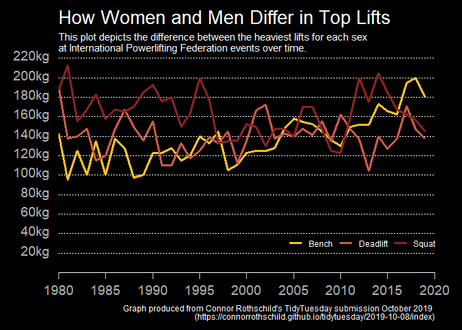
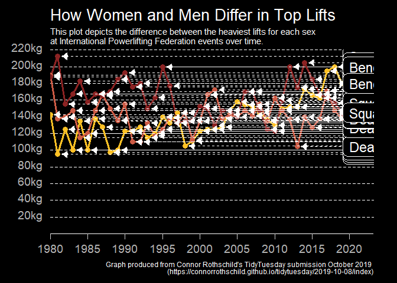
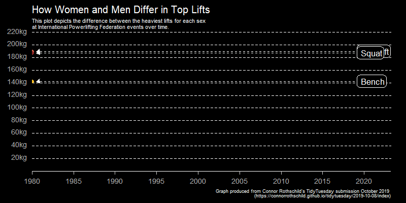

This week I thought I would explore the use of gganimate package to animate a ggplot graph. Connor Rothschild's, a undergraduate at Rice University, has created an excellent [TidyTuesday submission](https://connorrothschild.github.io/tidytuesday/2019-10-08/index), producing an animated line graph showing the differences between men and women's heaviest lifts. This used both the [ggplot2](https://ggplot2.tidyverse.org/) and [gganimate](https://gganimate.com) package so I thought I would work through his code to start to understand how to apply animation to a ggplot.

``` r
library(tidyverse)
library(lubridate)
library(gganimate)
library(ggdark)
library(scales)
```

First download and format the powerlifting data. This gave me the opportunity to use the recent pivot\_longer and pivot\_wider functions in tidyr to gather and spread the data frame.

``` r
# Download powerlifting data
ipf_lifts_raw <- readr::read_csv("https://raw.githubusercontent.com/rfordatascience/tidytuesday/master/data/2019/2019-10-08/ipf_lifts.csv") 

# Format data
ipf_lifts <- ipf_lifts_raw %>% 
  mutate(year = year(date)) %>% 
  pivot_longer(cols = c("best3squat_kg", "best3bench_kg", "best3deadlift_kg"), names_to = "lift", values_to = "weight") %>% 
  select(name, sex, year, lift, weight)

# Find heaviest lifts from each year
ipf_lifts_maxes <- ipf_lifts %>% 
  group_by(year, sex, lift) %>% 
  top_n(1L, weight) %>% 
  ungroup() %>% 
  distinct(year, lift, weight, .keep_all = TRUE)

# Find the difference between male and female heaviest yearly lifts
ipf_lifts_maxes <- ipf_lifts_maxes %>% 
  pivot_wider(names_from = sex, values_from = weight) %>% 
  arrange(name)

## Seperate and merge dataframe for each sex
male_lifts <- ipf_lifts_maxes %>% 
  select(-name) %>% 
  filter(!is.na(M)) %>% 
  group_by(year, lift) %>% 
  summarise(male = mean(M))

female_lifts <- ipf_lifts_maxes %>% 
  select(-name) %>% 
  filter(!is.na(`F`)) %>% 
  group_by(year, lift) %>% 
  summarise(female = mean(`F`))

## merge the two data frames based on shared year and lift columns
max_lifts <- merge(male_lifts, female_lifts)

## calculate difference between male and female heaviest yearly lifts
max_lifts_final <- max_lifts %>% 
  group_by(year, lift) %>% 
  mutate(diff = male - female) %>% 
  ungroup() %>% 
  mutate(lift = case_when(lift == "best3bench_kg" ~ "Bench",
                          lift == "best3squat_kg" ~ "Squat",
                          lift == "best3deadlift_kg" ~ "Deadlift")) 
```

Before using animation create a static ggplot graph depicting the difference between the heaviest lifts for each sex at International Powerlifting Federation events over time.

``` r
lift_colours <- c("#FFC125", "#CD5B45", "#8B2323")

graph_lift_diff <- ggplot(max_lifts_final, aes(year, diff, group = lift, colour = lift)) + 
  # Add line for each lift type
  geom_line(size = 1.2) + 
  # Format axes
  scale_x_continuous(limits = c(1980L, 2020L), breaks = seq(1980L, 2020L, by = 5L),
                     expand = expand_scale(mult = c(0L, 0L))) +
  scale_y_continuous(limits = c(0L, 220L), breaks = seq(20L, 220L, by = 20L),
                     expand = expand_scale(mult = c(0L, 0L)),
                     labels = unit_format(unit = "kg", sep = "")) +
  # Apply theme
  dark_theme_classic() +
  theme(plot.title = element_text(size = 20L),
        plot.margin = margin(10L, 30L, 10L, 10L),
        axis.text = element_text(size = 14L),
        axis.text.x = element_text(vjust = -0.2),
        axis.text.y = element_text(vjust = 0.2),
        axis.line.y = element_blank(),
        axis.ticks.y = element_blank(),
        axis.ticks.length = unit(0.25, "cm"),
        panel.grid.major.y = element_line(colour = "white", linetype = "dotted"),
        legend.title = element_blank(),
        legend.position = c(0.8, 0.14),
        legend.direction = "horizontal",
        legend.background = element_rect(fill = "transparent")) +
  # Apply line colours
  scale_colour_manual(values = lift_colours) +
  # Add labels
  labs(title = "How Women and Men Differ in Top Lifts",
       subtitle = "This plot depicts the difference between the heaviest lifts for each sex \nat International Powerlifting Federation events over time.",
       caption = "Graph produced from Connor Rothschild's TidyTuesday submission October 2019 \n(https://connorrothschild.github.io/tidytuesday/2019-10-08/index)",
       y = element_blank(),
       x = element_blank())
graph_lift_diff
```



To change this graph to an animated graph elements that are displayed across years are added to the graph. These can then be revealed by year so that the elements appear to move over time.

Add points to each lift for each year, a dashed arrow added pointing to each of these points and a label describing the lift type added at the end of the arrow. Remove the legend as it is no longer required and the x axis is also extended to accomodate the labels on the right.

``` r
graph_lift_diff_yearly <- graph_lift_diff + 
  # Add points for each lift type
  geom_point(size = 3L) +
  # Add horixontal dotted line from each point to right side of graph
  geom_segment(aes(x = year + 0.5, xend = 2019.1, yend = diff), colour = "white",
               linetype = "dashed", 
               arrow = arrow(length = unit(0.30,"cm"), ends = "first", type = "closed")) + 
  # Add lift label to right of each horizontal dotted line
  geom_label(aes(x = 2019.1, label = lift), color = "white", fill = "black",
             hjust = 0L, size = 6L, label.r = unit(0.5, "lines"), label.size = 0.5,
             label.padding = unit(0.4, "lines")) +
  # expand x axis to fit in labels on right hand side
  scale_x_continuous(limits = c(1980L, 2020L), breaks = seq(1980L, 2020L, by = 5L),
                     expand = expand_scale(mult = c(0L, 0.08))) +
  # remove legend and add grid lines back
  theme(legend.position = "none",
        panel.grid.major.y = element_line(linetype = 2))
graph_lift_diff_yearly
```



The graph is now ready to apply the animation.

``` r
animation <- graph_lift_diff_yearly +
   # animate graph revealing graph by year
  transition_reveal(along = year)

# Create animation gif file
animate(animation, 
        fps = 10L, 
        duration = 25L,
        end_pause = 20L,
        width = 800L, height = 400L, 
        renderer = gifski_renderer("./animation.gif"))
```


